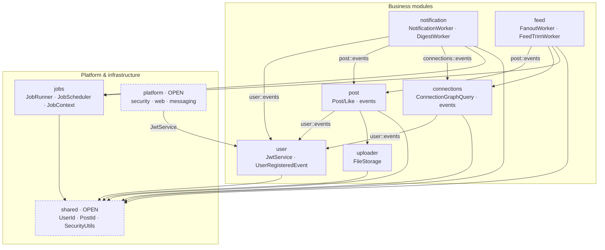
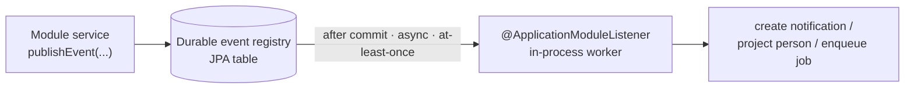
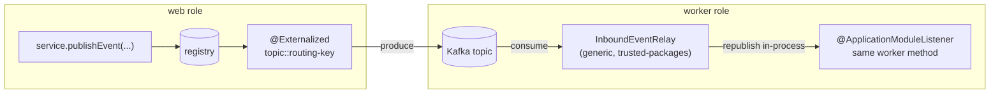
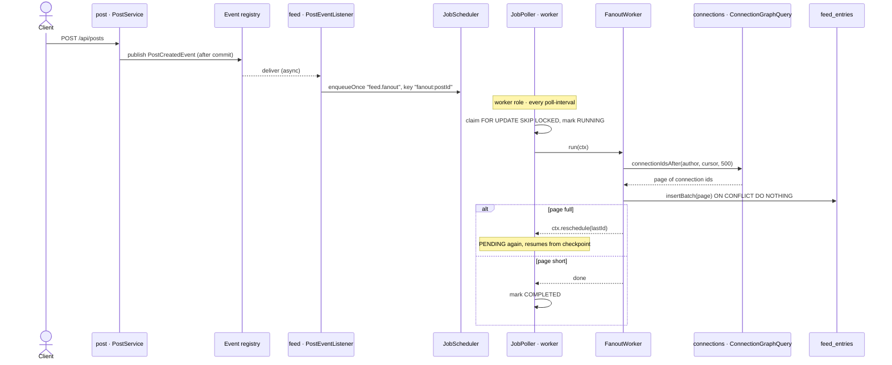
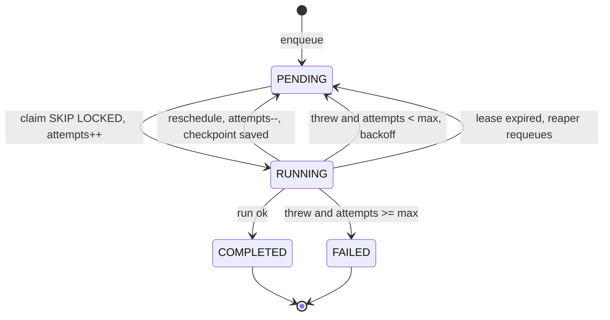
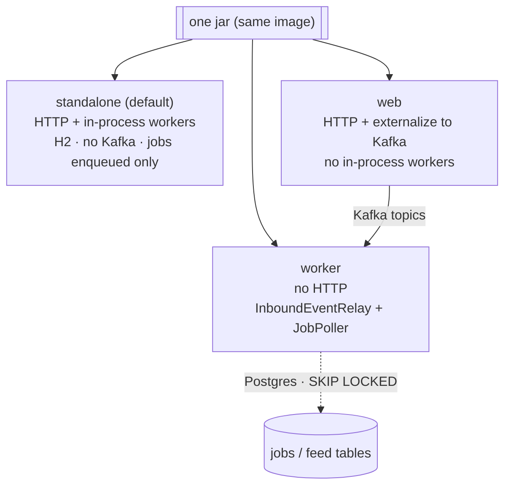

# Architecture

Diagrams render natively on GitHub (Mermaid). For a quick tour see the [README](README.md);
this doc is the visual reference for how the modules fit together and how work flows.

---

## 1. Module dependency graph

Every arrow is a **declared** `allowedDependencies` edge — `ModularityTests.verify()` fails
the build on any edge not drawn here. Labelled edges go to a module's `events` **named
interface** (the event records only); unlabelled edges use the module's default exposed API.
`platform` and `shared` are `OPEN` (may be depended on freely; not dependency-checked).

**Reading it:** business modules never reach into each other's internals — they depend on
another module's `events` interface (to react) or its narrow default API (`uploader.FileStorage`,
`connections.ConnectionGraphQuery`). `jobs` is generic and domain-free: things depend on it,
it depends on nothing domain-specific. `platform` (the app shell) is the only thing that
touches `user`'s service API, to validate JWTs.

---

## 2. Event delivery — in-process by default, Kafka at the seam

The **same** `@ApplicationModuleListener` methods handle both paths, so there is one copy of
each rule regardless of how it's deployed.

### Standalone (default, H2, zero dependencies)

### Split (web + worker, Kafka between them)

The web tier only *externalizes*; the worker tier consumes and processes. Workers are gated
`app.role != web`, so a split deployment never double-processes.

---

## 3. Post → feed fanout (why the `jobs` runtime exists)

A post by a well-connected author touches hundreds of thousands of feed rows — too much for a
one-shot listener. The listener just enqueues; the runtime does the chunked, resumable work.

`enqueueOnce` (keyed by post id) makes at-least-once delivery idempotent; keyset pagination
(`connectionIdsAfter`) avoids OFFSET degradation; `ON CONFLICT DO NOTHING` makes the resume
overlap a no-op.

---

## 4. Job lifecycle

Claiming is arbitrated entirely by the database — no registry, no leader election. Progress
(`reschedule`) is not a failed attempt; a dead worker's job is recovered by the reaper.

---

## 5. Deployment roles

One jar, three roles via `app.role` (the `web` / `worker` Spring profiles set it).

| Role | HTTP | Events | Jobs |
|---|---|---|---|
| `standalone` (default) | yes | in-process, durable registry | enqueued only (H2 can't `SKIP LOCKED`) |
| `web` | yes | externalized to Kafka | enqueued only |
| `worker` | no | consumed from Kafka via relay | poller executes them (Postgres) |
